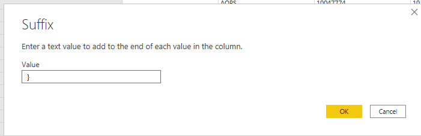

# How to Parse Azure Tags from the Usage data in PowerBI

1. You can export the usage from the Azure Portal or Connect through the Azure Usage API. I will assume tha that you have exported the usage.

1. Once you have the data downloaded, it will be in a csv format
    
1. Open PowerBI and Click on Get data
    
1. Choose Text/CSV and click Connect
    

1. Choose the downloaded CSV

    

1. On the Load Data Screen, Click on Transform Data

    

1. Promote and Use the First Row as Headers, if the column names are not at the top. If they already are, then disregard.

    

1. Now find the Tags column, you'll notice that the tags are in a Name:Value comma delimited string. We will covert this to JSON to parse.

     

1. Add a Prefix to the Tags
    1. Make sure the Tags column is selected
    1. then click on the Transform in the Ribbon
    1. Click on Format
    1. Click on Add Prefix 

     

1. Enter '{ ' into the Value, make sure to add the space after the {
     
     
     
1. Add a Suffix to the Tags
    1. Make sure the Tags column is selected
    1. then click on the Transform in the Ribbon
    1. Click on Format
    1. Click on Add Suffix 

    

1. Enter ' }' into the Value, make sure to add the space before the }
 
    

1. You should now see the Tags Column like this.

    

1. Now we need to transform the column to JSON by
    1. Right click on the column
    1. Click Transform
    1. Click JSON

    

1. The column should not be transformed. We will now split out the columns.
    1. Click on the Pivot Icon at the top.
    1. Click on the 'Load more' link

    

1. You will now see that the tags have been parsed, you can select or de-select the tags you want parsed into columns. Keep in mind that this will only evaluate the first 1000 records on the data. I will illustrate how to add more tags later.

    

1. You should now see all the Tags parsed out as columns. They will have the Prefix of Tags in the Column name.

    

1. If there are additional tags that were not a part of the 1000 records evaluated, you can manually add them. In the Applied Steps of the Transformation click on the 'Expanded Tags' 

    

1. In the Ribbon click on Home > Advanced Editor
    
    

1. You can modify the ExpandedRecordColumn function in the Advanced Editor, reference to it can be found here https://docs.microsoft.com/en-us/powerquery-m/table-expandrecordcolumn . Here you will be able to modify the fieldNames to include any Tags that may not have been evaluated, then add the newColumnNames that you want them to be added to in the data. So, as an example, let's say that the evaluateion missed a Column named "MyCustomTagName" and I want to add it. 
    1. Add it to the fieldNames parameter list

        

    1. Add the a new column name to the newColumnNames parameter list.

        

1. Now you should see all the tags as columns in the Fields selector in Power BI and can be used to build your reports.

